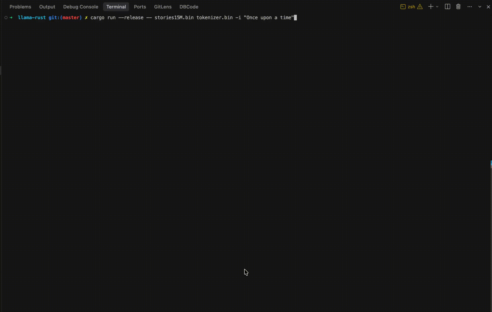

# llama-rust



A Rust port of `llama2.c` for running small LLaMA-style checkpoint files locally from the command line.

This project loads a model checkpoint, loads a tokenizer, encodes an input prompt, runs autoregressive inference, samples tokens, decodes them, and prints the generated text.

## Requirements

- Rust and Cargo installed
- A compatible model checkpoint, for example `stories15M.bin` or `stories110M.bin`
- A compatible tokenizer file, for example `tokenizer.bin`

The model and tokenizer files should be available locally. The examples below assume they are in the project root.

## Project Files

```text
src/main.rs        command-line entry point and generation loop
src/model.rs       checkpoint config and weight loading
src/tokenizer.rs   tokenizer loading, prompt encoding, and token decoding
src/forward.rs     transformer forward pass
src/sampler.rs     greedy, multinomial, and top-p sampling
src/math.rs        math helpers used during inference
```

## Run

From the project root:

```bash
cargo run --release -- stories15M.bin tokenizer.bin
```

With a prompt:

```bash
cargo run --release -- stories15M.bin tokenizer.bin -i "Once upon a time"
```

With generation options:

```bash
cargo run --release -- stories15M.bin tokenizer.bin -i "Once upon a time" -n 128 -t 0.8 -p 0.9 -s 42
```

## Options

```text
-i <prompt>       input prompt, default is empty
-n <steps>        number of tokens to generate, default is 256
-t <temperature>  sampling temperature; 0.0 means greedy, default is 1.0
-p <topp>         top-p sampling value from 0 to 1, default is 0.9
-s <seed>         random seed, default is time-based
```

## Build

```bash
cargo build --release
```

Then run the compiled binary directly:

```bash
./target/release/llama-rust stories15M.bin tokenizer.bin -i "Tell me a story" -n 128
```
